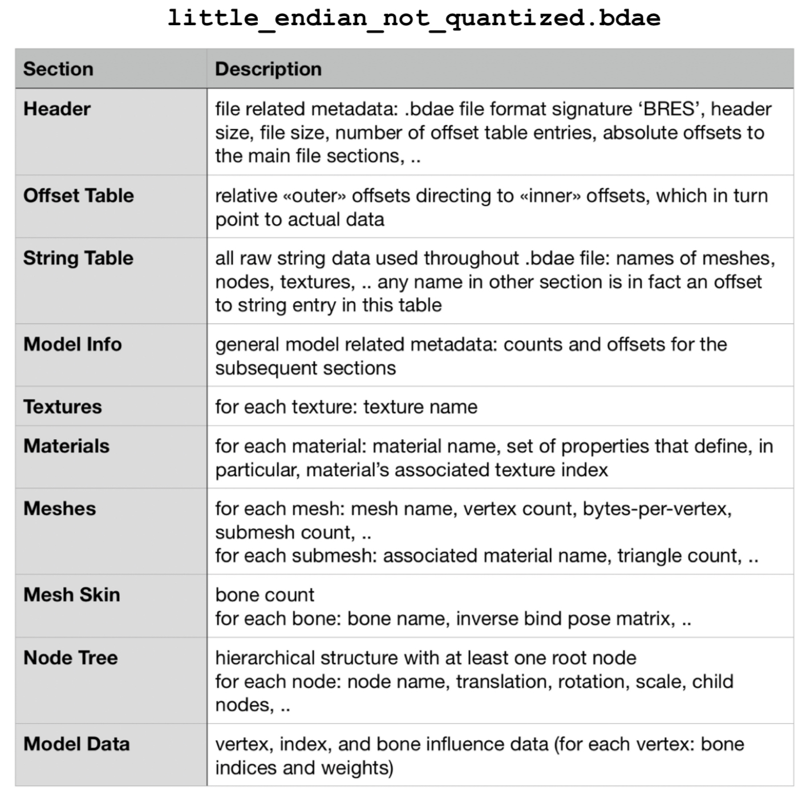
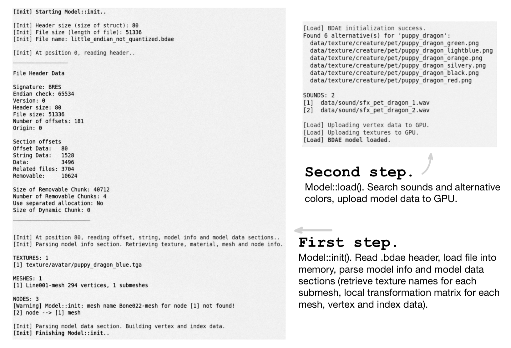
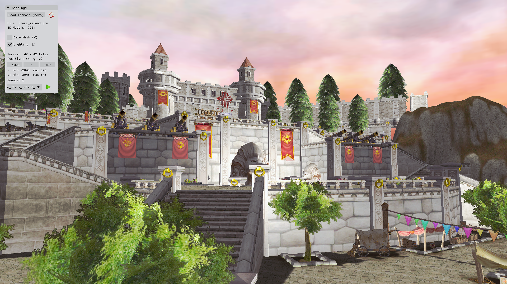
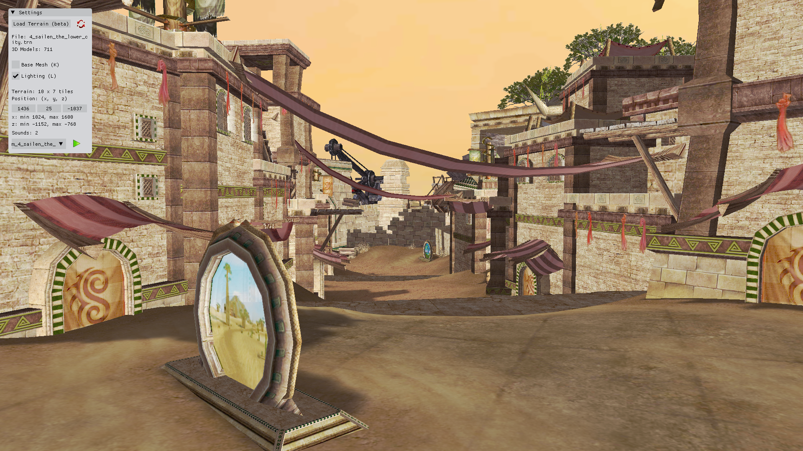

<!-- markdownlint-disable MD001 -->

# .BDAE File Format Parser and Viewer 📄

### Project overview

This work is the outcome of combined reverse-engineering and game-engine source code research. The code here has nothing to do with the original game engine — this reference engine was only analyzed to get additional info about the format. After reading the below documentation, you may understand the BDAE format structure.

The project implements a 3D model viewer with 2 modes. First mode allows to view and animate a `.bdae` model (BDAE file version 0.0.0.779 used in Gameloft's title Order and Chaos Online), and second mode extends it to render an entire map, which adds up parsing the following Gameloft's file formats: `.trn`, `.itm`, `.phy`, `.nav`, `.msk`, and `.shw` – representing terrain surface, list of .bdae model names and their info, physical surfaces, walkable surfaces, terrain surface textures blending weights, and pre-rendered shadows, respectively. With these game assets integrated and parsed, plus lighting, audio, free-flight camera, and memory optimizations (such as dynamic map loading and asset registration), the project can be called a lightweight end-to-end game engine, effectively replacing Gameloft's Glitch Engine for custom formats reading (the implementation does not rewrite or imitate it) in a simplified and understandable way. After compilation, it is a standalone application, written in C++ and using OpenGL 3.3 as its rendering backend, with GLSL for programmable shaders. 

### Main information

All game 3D models are stored in binary files of the .bdae format. They include __data for mesh, material, textures, nodes, bones, SFX, and animations__. BDAE stands for __Binary Digital Access Exchange__ and is a binary version of the DAE format, which itself is written in the XML language common for 3D models. The binary nature of .bdae files makes them superior in terms of size, runtime efficiency, and protection. When developers introduce new game assets, they run a dae2bdae script. __The developer of .bdae is Gameloft — it is used in their games and natively supported by their Glitch Engine__ (which itself is based on the [Irrlicht Engine](https://irrlicht.sourceforge.io/)). .bdae file format is not unified — each game uses a different version of it. Furthermore, each version has 4 subversions. The subversion is likely generated or updated automatically based on the configuration of the Glitch Engine.

Known information about .bdae file format is limited and located across a few forums. This is because __for reading and understanding these files you would have to do reverse-engineering__. For OaC .bdae files, this has been done in [Game Engine Filetypes Reverse Engineering](https://github.com/lOlbas/Game-Engines-Filetypes-Reverse-Engineering). That project provides a file-parsing template to view the structure of a .bdae file in a binary file editor like [010 Editor](https://www.sweetscape.com/010editor/). However, because this is a pure individual-file-based reverse engineering approach without having the game engine's source code as a reference, some 3D model data interpretations remain incomplete or incorrect.

Another problem is that not only can you not easily read and understand .bdae files, but more importantly, there is no convenient software to render the 3D models they contain. Several available tools you might find are based on custom-written plugins that are unstable; they may work on one .bdae version and fail on others. For the OaC .bdae file version, the only reliable option is [Ultimate Unwrap 3D Pro](https://www.unwrap3d.com/u3d/index.aspx), which does support the format, yet can only display a mesh, without any textures applied.

### BDAE file structure

Most likely, the .bdae file structure is based on the [Nintendo BRRES format](http://wiki.tockdom.com/wiki/BRRES_(File_Format)) (perhaps Gameloft got the format specs from Nintendo while developing for one of their platforms and kept it). It consists of 5 sections:

### BDAE model viewer mode

The .bdae viewer consists of:

- `main.cpp` – main file in the project and viewer’s core implementation (explained below).
- `parserBDAE.cpp` – implementation of functions for .bdae parsing (explained below).
- `model.cpp` – implementation of functions for .bdae rendering (explained below).
- `model.h` – .bdae compilation flags, file structure, and class definition.
- `shader.h`, `shaders/model.vs`, `shaders/model.fs`, (`shaders/lightcube.vs`, `shaders/lightcube.fs`) – implementation of the graphics pipeline. OpenGL requires GLSL source code for at least one vertex shader and one fragment shader.
- `camera.h` – implementation of the camera system. OpenGL by itself is not familiar with the concept of a camera, so we simulate it using Euler angles.
- `light.h` – light settings for the Phong lighting model and definition of the light source (a light cube is displayed for reference).
- `sound.h` – implementation of the sound playback.
- `libs/miniaudio.h` – single-header library for audio engine.
- `libs/stb_image.h` – single-header library for loading texture images.
- `libs/glad` – library for loading OpenGL functions.
- `libs/glfw` – library for creating windows and handling input.
- `libs/glm` – library for OpenGL style mathematics.
- `libs/imgui` – Dear ImGui library for file browsing and settings UI.
- `libs/oac/io` – input / output library that provides an interface for reading any game resource files from various sources (disk, memory, Gameloft's custom packed resource format, ZIP archives) with efficient memory management and reference counting. It is a part of the Glitch Engine, but has no dependencies on other engine modules.

This mode allows to load and view a .bdae model as textured / wireframe + edges, enable / disable lighting, freely fly around or rotate the model, play animations and sound effects (if the model has them), and change its color appearance (if a model has alternative textures). Furthermore, it supports .bdae 0.0.0.779 subversions from OaC v.1.0.3 and v.4.2.5 (the beta and latest versions of the game, respectively).

__How does the .bdae parser work? $\quad$ (`parserBDAE.cpp`)__

Assume we opened the outer `some_model.bdae` archive file and there is a file `little_endian_not_quantized.bdae` inside it, which is the real file storing the 3D model data (see `main.cpp`), and so we opened this inner file as well. Now, we call the function `Model::init()`, which executes a straightforward __linear parsing__ approach: 

1. Reads the .bdae header to get offsets to the main file sections.
2. Loads the entire file into memory as raw binary data.
3. Parses general model info section, which stores counts and offsets for the subsequent __sections: animations, textures, materials, meshes, skinning, node tree__. A count of 0 means that the .bdae does not contain that kind of data. For example, the animation count is always 0 in the model .bdae because animations are stored in a separate .bdae animation file.
4. Parses texture names. One model may have multiple textures.
5. Parses material names and texture indices. __Without materials, we will not correctly match a submesh to its texture__ — we’d be guessing, likely assigning retrieved textures at random. One model may have multiple materials, each material may only have one texture index (and I believe it is always attached). A material has various *material properties*; the property of type 11 (`SAMPLER2D`) holds a texture index value. This is index into the array of textures parsed in p.4.
6. Parses meshes and submeshes data, matches submeshes with textures. One model may be a combination of multiple meshes; each mesh may be subdivided into several submeshes. A submesh has its own index data, stored consecutively but separately in the .bdae file; this split is defined in this section. Each submesh should (and can) be mapped to only one texture; each texture can be reused by multiple submeshes. Per-mesh data: name, vertex count, vertex data offset, bytes-per-vertex, submesh count. Per-submesh data: triangle count, index data offset, material name (used to map submesh with texture).
7. Parses node tree data recursively, matches nodes with meshes, and computes nodes transformations. __Without node tree, we will not correctly position meshes in a static model or not be able to influence vertices in an animated model__ — they would remain at their default positions. One model has one *node tree* (I found no counterexamples). It's a tree structure with parent-child hierarchy and $\ \ge 1 \ $ root nodes. __A *node* is a transform entity that defines translation, rotation, and scale for a mesh in the model's scene graph__ (for skinned models, nodes switch from per-mesh to per-vertex influence scope $^{(*)}$). Each mesh should (and can) be mapped to only one node; each node may be mapped to one mesh or none (for example, nodes can be bones or empty helper nodes $^{(*)}$). Per-node data: 3 names (each used for specific mapping), children count, children data offset, translation, rotation, scale.
8. Parses vertex and index data. We iterate over every mesh and extract its vertices and indices: all vertex data goes into a single vector, while index data is stored in separate vectors for each submesh to ensure correct rendering.
9. Parses mesh skin (bones) data and matches bones with nodes. __Without mesh skin, we will not be able to influence vertices in an animated model.__ One model may have one *mesh skin* or none. If present, the model is *skinned* and can be animated, otherwise it is a static model. Skinning is based on the concept of bones. __A *bone* is a "job" given to a node that allows it to influence specific vertices rather than the entire mesh; bones form the model’s skeleton, while the influenced (or “skinned”) vertices act as the model’s skin.__ Each bone should (and can) be mapped to only one node; each node may be mapped to only one bone or none. Bones introduce *bone influence* per-vertex data: up to 4 bone indices and corresponding influence weights. Per-bone data: name, __*inverse bind pose matrix*. This matrix transforms the bone's influenced vertices from the *skeleton space* (or "bind pose" space — it is the coordinate system in which the skeleton was defined in the .bdae file and where vertices are expected to "sit" in a skinned model) into the bone's local space (or "bone's default frame").__ The idea for this inverse transformation is to ensure that the vertex’s position relative to the bone remains fixed during animation, while its absolute position in skeleton space changes. The next transformation (updated bone transformation matrix) will "send" the vertex back to skeleton space, and so it ends up being in the bone’s new animated frame. The next transformation.. it's kind of a waste of text to explain math in words rather than formulas, so refer to the next paragraph. However, one last matrix needs a context. Skeleton space and mesh space is same.. but different. Raw vertex positions in the .bdae file are stored in mesh-local space, which is not always the same as skeleton space — when they differ, you’ll see misalignment between mesh and nodes. The "fix", or correction, is called __*bind shape matrix*. This matrix transforms the mesh's vertices from mesh-local space into skeleton space (i.e., to their corrected bind positions).__

Mathematically, the node tree and skinning can be illustrated with a few formulas.  
As mentioned in p.7, we recursively compute a transformation matrix for each node. As the tree structure suggests, children are influenced by parents. A node's own local transformation, which by itself is a *Translation-Rotation-Scale matrix* (TRS; note that the effective order of transformation is reversed: scale → rotate → translate) must be combined with its parent's transformation, which is by that time already includes the accumulated transforms of all ancestor nodes. We must also account for a *PIVOT offset*, which is specific to .bdae models. The node tree may have `_PIVOT` helper nodes: these are leaf nodes and don't have meshes attached. They affect all parent nodes that are associated with meshes.  
TRS matrix is also commonly called the *model* matrix and denoted as *M*. I prefer to call it the *local* matrix here, because it moves nodes relative to the model rather than around the global scene (the local → world transformation is what’s normally meant by “model” matrix).  

Recursive node transformation:

$$
L_{node} = L_{parent} \cdot L_{own} \cdot L_{pivot}, \quad L = T \cdot R \cdot S
$$

, where  
$L_{node}$ – total local transformation 4 x 4 matrix of a node  
$L_{own}$ – local transformation matrix of a node  
$L_{parent}$ – local transformation matrix of the node's parent  
$L_{pivot}$ – local transformation matrix of a PIVOT node (if exist)  
$T$ – translation matrix  
$R$ – rotation matrix  
$S$ – scale matrix

For static models, nodes influence meshes (and hence all vertices of that mesh):

$$
v^{\ \prime}= L_{node} \cdot v 
$$

For skinned models, nodes act as bones and influence vertices using *Linear Blend Skinning (LBS)*:

$$
v^{\ \prime} = (\sum_{i=0}^{N} w_i \cdot (B \cdot L_{node_i} \cdot I_i)) \cdot v, \quad  \sum_{i=0}^{N} w_i = 1
$$

, where  
$v$ – default vertex position (in bind pose space)  
$v^{\ \prime}$ – resulting vertex position  
$N$ – number of bones that influence this vertex; for .bdae models $0 \le N \le 4$  
$w_i$ – influence weight of the $i$-th bone; in range $[0, 1]$  
$B$ – bind shape 4 x 4 matrix  
$I_i$ – inverse bind pose 4 x 4 matrix of the $i$-th bone

__Now, let's discover that if we change *T*, *R*, *S* every frame, the model is transformed dynamically, which is the definition of animation.__ These values at specific times are stored in a __separate .bdae animation file__, which is parsed in the next step.

 So the next step is to return to the function `Model::load()`, which completes the 3D model loading process by searching for additional files on disk and loading them (__this search relies on manually named files__), and finally uploading all model data to the GPU. Detailed:

 10. Searches for alternative textures. One model may have different color variations except for the default texture encoded in the .bdae file. Information about these alternatives is not present in the .bdae file. The search processes the model's file name to generate a name shared by a group of related textures (alternative colors) using "max-match" approach — tests each prefix and selects the one that gives the highest number of matching `.png` texture files found on disk.
 11. Searches for animations and loads them. One (skinned) model may have different animations. Information about them is not present in the model's .bdae file. The search looks for special `.bdae` animation files on disk in the folder that exactly matches the model's file name. Loading animations requires understanding of the *channel-sampler architecture*:  
 __*Sampler* tells "how to animate" – it defines how keyframes are used to generate animation over time, holding timestamps (= keyframe times = input sources), animation data (= transformations = output sources), and interpolation type (how values are blended between keyframes).__  
 __*Channel* tells "what to animate" – it connects a sampler to a specific target node of the .bdae model__.  
 Generally speaking, this is just a logical abstraction designed to make the animation system modular. A sampler + channel represent one *base animation* — a single animation track that defines one transformation property (translation, rotation, or scale) of one target node over time. The number of these base animation tracks in a .bdae animation file is therefore equal to $\text{number of animated nodes} \cdot 3$. Per animation file data: duration, array of base animations. Per base animation data: target node name, animation type, interpolation type $^{(*)}$, timestamps (in seconds), transformation values (vectors or quaternions).
 12. Searches for sounds. One model may have different sounds. Information about them in not present in the .bdae file. The search looks for `.wav` files on disk containing the model's file name.
 13. GPU uploading. This is done in a standard OpenGL way. We setup 3 buffers: a *Vertex Array Object* to store vertex attribute configurations, a *Vertex Buffer Object* to store vertex data, and an *Element Buffer Object* for each submesh to store index data. In addition, textures are loaded from image files, converted to raw pixel data, and uploaded to the GPU as OpenGL textures. VAO, VBO, EBO(s), and texture(s) reside on the GPU and are referenced via their generated object IDs.

__Offset Table__ section is unused in this project, but it is a key part of the Glitch Engine's .bdae loading pipeline.

__String Table__ section is used for materials, nodes, and bones as a __reference mapping for names__. For instance, to match a submesh with its node, we check whether both point to the same string table entry, which is the material name for this submesh / node.

__How does the .bdae viewer work? $\quad$ (`model.cpp` and `main.cpp`)__

The viewer is a standard OpenGL application built on fundamental concepts of Computer Graphics. It uses __OpenGL 3.3__ as its rendering backend (core profile, enabling full control over the graphics rendering pipeline), with __GLSL__ for programmable shaders.

Here is a very brief explanation of how any OpenGL app works. An OpenGL program initializes by setting up a window, creating an OpenGL context (the connection between OpenGL and the windowing system), and loading the necessary libraries. → It then compiles shaders to define the graphics pipeline, configures buffers and textures to process and store graphical data on GPU. → During rendering, the program references this data by object ID, executes the shaders, and draws objects on the screen. Once running, the program enters a continuous event loop (also known as the __game / render loop__) where it waits until a new event occurs. The programmer registers callback functions with OpenGL to handle events – such as mouse movement, keyboard input, or window resizes. When an event occurs, the system automatically queues and processes these events, invoking the corresponding callback.

To implement a 3D model viewer, to this basic OpenGL program workflow we need to add the camera system, file‑loading and a settings interfaces (done with the Dear ImGui library), and in the end extra features such as a lighting model, sound playback or display‑mode switching...

..But if the dragon in the image below is moving, it seems I forgot the last nail in the coffin. __How to render animations?__. Say, a dragon wing's transformation values are defined for times in seconds: 0, 0.05, 0.1 (all this data is parsed from the .bdae animation file, as explained before). What do we do when the current time is 0.03? The .bdae format gives a definitive answer – it stores interpolation type, which can be step / linear / hermite (smooth cubic). We interpolate one transformation value at a time (translation, rotation, or scale), and the value type is either a vector for translation and scale, or a quaternion for rotation. For example, vector interpolation is performed component-wise (on each scalar float component). Scalar interpolation is defined as:

$$
\begin{aligned}
f(a, b, t) &= a && \text{step} \\
f(a, b, t) &= a + (b - a) \cdot t && \text{linear} \\
f(a, b, t) &= a + (b - a) \cdot t^2 \cdot (3 - 2 \cdot t) && \text{hermite}
\end{aligned}
$$

, where  
$a$ – previous keyframe value  
$b$ – next keyframe value  
$t$ – current time between these keyframes, normalized to range $[0, 1]$ (also known as *interpolation factor*)

After updating node's translation, rotation, and scale to the new interpolated values, we form its TRS (local transformation) matrix, and all that remains is to update the influenced vertices using linear blend skinning explained earlier. __.bdae animations are authored to be played at 30 FPS__, but sampled at approximately 15 FPS. This means that if OpenGL application runs at 30 FPS, the interpolation occurs every other frame.   
FPS and sampling rate were derived from the following example in one of the .bdae animation files. Timestamps (frame number values): [0, 2, 4, .. , 72], animation duration: 2.4 sec. 72 / 2.4 = 30 FPS. However, there are 37 values in that array. 37 / 2.4 ≈ 15 FPS 

 Now, the .bdae file viewer is complete.

### BDAE terrain viewer mode

The terrain (map) viewer adds:
- `terrain.cpp` –  class for loading and rendering terrain (explained below).
- `terrain.h` – class definition.
- `parserTRN.cpp` – class for loading surface of one terrain tile from a .trn file and storing other tile data.
- `parserTRN.h` – class definition.
- `parserITM.h` – functions for loading game object (.bdae model) names and their world space information of one terrain tile from an .itm file, and for calling .phy + .bdae parsers for each game object.
- `parserPHY.h` – class for loading physics geometry of one game object from a .phy file and storing its mesh data.
- `water.h` – class for loading and rendering water.
- `shaders/terrain.vs`, `shaders/terrain.fs`, `shaders/water.vs`, `shaders/water.fs`, `shaders/skybox.vs`, `shaders/skybox.fs` – shaders for terrain-related entities.
- `libs/oac/base` – utility classes for vector and matrix operations (this dependency should be removed).
- `libs/oac/navmesh` – Detour navigation system library for managing walkable surfaces.

This mode effectively is a game engine and it allows to load and view a terrain with all 3D models, water, and sky, while integrating physical and walkable surfaces. All these terrain entities are loaded from custom Gameloft file formats that had to be analyzed and parsed.

`terrain.cpp` is under 2000 lines of code and can load terrain consisting of 1000 tiles with over 10,000 3D models. A __terrain tile__ is a fixed-size square section (small part) of the terrain, and such partition used primarily for rendering optimization. Instead of rendering the entire map each frame, only a certain number of tiles are drawn, with tiles being activated or deactivated as the camera moves across the map. __The vertex and index data for each tile is precomputed during the initial map loading on CPU, then, in each frame, data buffers on GPU are updated – the engine determines which tiles should be rendered in the current frame based on camera position and orientation (distance-based culling + frustum culling).__ Additional optimizations affect CPU-side map loading — shared pointers for .bdae and .phy models enable a global cache and significantly reduce RAM usage; similar idea is done for terrain surface textures.

$$
1\ \text{tile} = 8 \times 8\ \text{chunks} = 64 \times 64\ \text{world space units}
$$

 These values are not from my imagination – 1 tile = 1 .trn, .itm, .nav, and .msk files, and the layout of binary data stored in them follows the chunk-unit separation structure. Their loading process works as follows: __1. Open one of each .trn / .itm / .msk / .nav / .phy  archive.__ These are ZIP archives with their extensions renamed to match the asset types they contain. Inside each archive, the number of files is less than or equal to the number of terrain tiles — each file represents one tile, and the filename encodes its grid position (for example, `-008_0007.trn` corresponds to (x, z) = (-8, 7) on the terrain grid). Some grid positions may be missing, meaning that either the tile does not exist or specific data for it is unavailable. __2. Iterate over each tile in the terrain (each file in the archive) and call the corresponding parser.__ These parsers store the parsed data in structures or vectors, forming a one-to-one code-level representation of the binary contents of these formats — not yet mesh data. __3. Build meshes (vertex and index data) in world space coordinates.__ Here, the retrieved data and metadata are “unpacked” into a format suitable for OpenGL. For example, vertices are stored in a flat vector where every 3 consecutive vertices form a triangle — the most efficient elementary OpenGL primitive for terrain rendering. __4. Extra – load skybox, set up the camera's starting position, and search for ambient music.__ Skybox is a sphere rather than a cube and it is just a .bdae model. The only difference is that it requires different shaders to create an effect of being "infinitely far away" from the camera.

### Manual
___
If you aim to rework the parser for a __.bdae version different from 0.0.0.779__, I recommend the following steps: 1. Read the above documentation. → 2. Install 010Editor (it has a free 30-day trial) and run my binary parsing template on a test model (File -> Open File -> Select `aux_docs/example.bdae` -> Templates -> Open Template -> Select `aux_docs/BDAE_model.bt` -> Templates -> Run Template) → 3. Open the original COLLADA model `aux_docs/example.dae` in any XML viewer. This .dae file is the source of that model before it was converted to binary .bdae. → 4. Open any model of your target .bdae version in 010Editor and rework my .bt template until you enjoy reverse engineering (start by parsing the header, general model info, meshes, and vertex/index data; at this point, the .bdae model can already be rendered correctly) → 5. Depending on the aim, you may or may not need to open this project's source code. However, the code is as well-structured and annotated as this README.
___

__Pre-compiled builds for Windows / Linux can be downloaded from my [Google Drive](https://drive.google.com/drive/folders/19uDs_jDS1yYuNcj61CEjhljezErinMBC?usp=drive_link)__. They already include the game assets (models and terrain files that can be opened with this viewer) sourced from __OaC v.4.2.5a__. Note that these builds do not support assets from __OaC v1.0.3__ (recompilation is required). Also note that, for performance optimization in terrain viewer mode, I have currently disabled (commented out) the loading and rendering of .phy and .nav files, as these files do not contribute any visual detail.

Compatibility: __.bdae version 0.0.0.779, subversions little-endian 32-bit / 64-bit__   
OS: __Windows / Linux__

__How to compile from source?__
1. Download the game assets archive `assets-oac-v.4.2.5a.zip` from the Google Drive link above, and place the `data` folder in the project's root directory.
2. Download the source code.  
`git clone git@github.com:fata1error404/oac-bdae-viewer.git`
3. Install dependencies.  
For Windows:  
[MSYS2](https://www.msys2.org/) which will give you terminal environment and Unix-like subsystem.  
Open MSYS2MINGW64 as administrator and run  
`pacman -S mingw-w64-x86_64-make` – MinGW build tools  
`pacman -S mingw-w64-x86_64-gcc` – MinGW relies on gcc for compilation  
`nano ~/.bashrc`  
`alias make='mingw32-make'` (add this line to .bashrc file and save)  
`source ~/.bashrc`  
$\quad$  
For Linux:  
`sudo apt-get install mesa-common-dev`
 –  core OpenGL utilities development headers  
`sudo apt-get install libglfw3-dev libglm-dev` – necessary development libraries (GLFW for handling windowing and input, GLM for OpenGL-style mathematics)  
4. Compile and launch (same for Windows and Linux).  
`make`  
`./app`

Additionally, you can modify conditional compilation flags defined in `model.h`:  
`CONSOLE_DEBUG_LOG` – to show / hide .bdae parser detailed output in the terminal.  
`BETA_GAME_VERSION` – to switch between 32-bit / 64-bit .bdae subversions (from OaC v.1.0.3 and v.4.2.5, respectively).

### Keyboard controls:

__W A S D__ – camera movement  
__Left Mouse Button__ – camera rotation  
__Right Mouse Button__ – model rotation  
__K__ – base / textured mesh display mode  
__L__ – enable / disable lighting  
__F__ – fullscreen mode  
__Escape__ – exit
