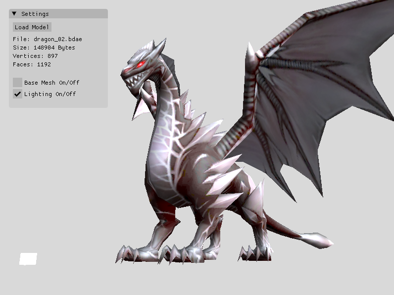
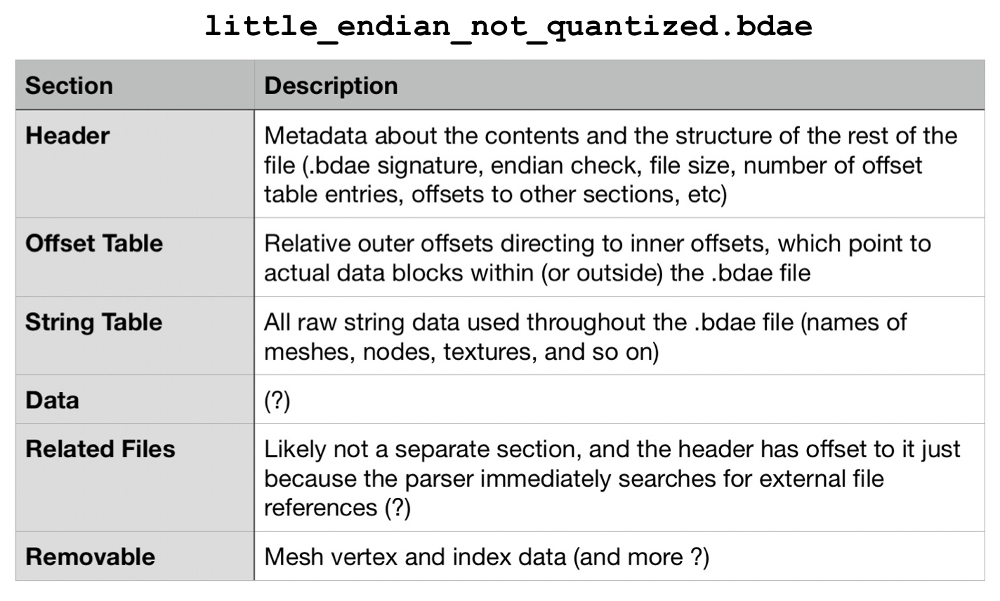
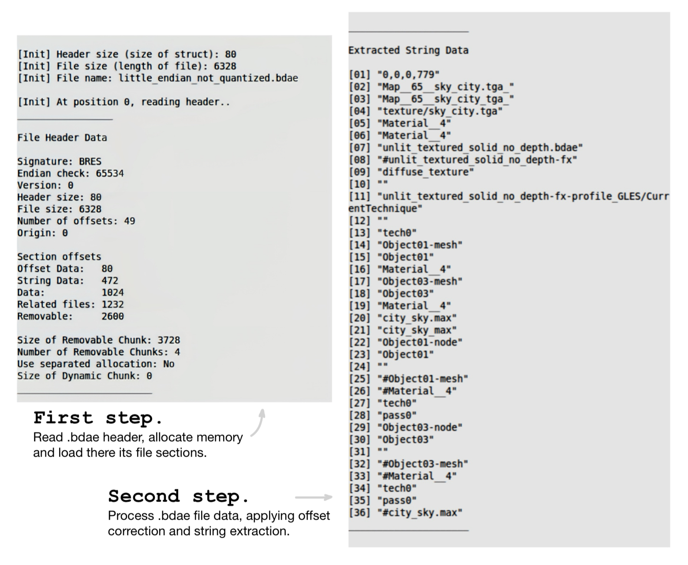

<!-- markdownlint-disable MD001 -->

# .BDAE File Format Parser and Viewer 📄

### Project overview

This project implements a 3D model viewer for the .bdae file format, based on OpenGL 3.3 + the .bdae parser from Gameloft’s game engine, and is compiled into a standalone application. The parser does the initialization: loads the file sections into memory and processes file data, applying offset correction and extracting the strings. Originally borrowed from the source code of another Gameloft title, it has been modified to support the 64-bit .bdae file version 0.0.0.779 used in Order and Chaos Online v.4.2.5a. The viewer displays the model: using the output of the parser, it builds the mesh vertex and index data, loads associated texture(s), and renders the 3D mesh with the OpenGL backend.

After reading the below documentation, you may clearly understand what is the .bdae file format, which is a result of my combined reverse-engineering and game-engine source code research.

### Result

### Main information

All game 3D models are stored in binary files of the `.bdae` format. They include __data for mesh, material, textures, nodes, bones, SFX, and animations__. BDAE stands for __Binary Digital Access Exchange__ and is a binary version of the DAE format, which itself is written in the XML language common for 3D models. The binary nature of .bdae files makes them superior in terms of size, runtime efficiency, and protection. When developers introduce new game assets, they run a dae2bdae script. __The developer of .bdae is Gameloft — it is used in their games and natively supported by their Glitch Engine__ (which itself is based on the [Irrlicht Engine](https://irrlicht.sourceforge.io/)). .bdae file format is not unified — each game uses a different version of it. Furthermore, each version has 4 subversions. The subversion is likely generated or updated automatically based on the configuration of the Glitch Engine.

Known information about .bdae file format is limited and located across a few forums. This is because __for reading and understanding these files you would have to do reverse-engineering__. For OaC .bdae files, this has been done in [Game Engine Filetypes Reverse Engineering](https://github.com/lOlbas/Game-Engines-Filetypes-Reverse-Engineering). That project provides a file-parsing template to view the structure of a .bdae file in a binary file editor like [010 Editor](https://www.sweetscape.com/010editor/). However, because this is a pure individual-file-based reverse engineering approach without having the game engine's source code as a reference, some 3D model data interpretations remain incomplete or incorrect.

Another problem is that not only can you not easily read and understand .bdae files, but more importantly, there is no convenient software to render the 3D models they contain. Several available tools you might find are based on custom-written plugins that are unstable; they may work on one .bdae version and fail on others. For the OaC .bdae file version, the only reliable option is [Ultimate Unwrap 3D Pro](https://www.unwrap3d.com/u3d/index.aspx), which does support the format, yet can only display a mesh, without any textures applied.

### BDAE file structure

Most likely, the .bdae file structure is based on the [Nintendo BRRES format](http://wiki.tockdom.com/wiki/BRRES_(File_Format)) (perhaps Gameloft got the format specs from Nintendo while developing for one of their platforms and kept it). It consists of 6 sections:

### BDAE file parser

The .bdae parser consists of:

- `resFile.cpp` – parser’s core implementation (explained below).
- `resFile.h` – parser's header file that declares the in-memory layout of the .bdae File object and its header structure.
- `access.h` – utility header that provides an interface for accessing loaded data either as a file-relative offset or as a direct pointer.
- `libs/io` – input / output library that provides an interface for reading any game resource files from various sources (disk, memory, Gameloft's custom packed resource format, ZIP archives) with efficient memory management and reference counting. It is a part of the Glitch Engine, but has no dependencies on other engine modules.

 These files were taken from the Heroes of Order and Chaos game source code and reworked. Their .bdae parser was implemented as a utility module of the Glitch Engine, accessible under the `glitch::res` namespace. It is the absolute __entry point for a .bdae file in the game, performing its in-memory initialization__. When the world map loads, the very first step is to correctly load all game resources, and for .bdae files, this parser is responsible for that.

 My target was to build a parser independent of the Glitch Engine that would correctly parse .bdae files from the latest OaC version 4.2.5a. In order to achieve this, the __parser had to be hardly modified: handled .bdae version difference (OaC uses v0.0.0.779 against v0.0.0.884 in HoC) and architecture difference (old OaC v1.0.3 and HoC .bdae files are designed to be parsed by a 32-bit game engine, while newer OaC v.4.2.5a files expect a 64-bit game engine), Glitch Engine dependency removed, refactored and highly annotated__. Advanced explanation – it appears that inside a .bdae version there are 4 possible subversions / architecture configurations: big-endian 32-bit, big-endian 64-bit, little-endian 32-bit, and little-endian 64-bit. Attempting to parse a .bdae file of the wrong architecture would lead to undefined behavior, as 32-bit systems are written for a pointer size of 4 bytes, and in 64-bit systems it is 8 bytes, resulting in incorrect offsets. OaC v1.0.3 and HoC both use little-endian 32-bit .bdae files, while OaC v.4.2.5a uses little-endian 64-bit (both of the .bdae version 0.0.0.79), i.e., the old parser is incompatible with the latest OaC .bdae files. This issue has been resolved.

__How does the .bdae parser work?__

Assume we opened the outer `some_model.bdae` archive file and there is a file `little_endian_not_quantized.bdae` inside it, which is the real file storing the 3D model data (see `main.cpp`), and so we opened this inner file as well. Now we call the initialization function `Init()`, which is split into 2 separate functions with the same name. __In the first function, we read the raw binary data from the .bdae file and load its sections into memory.__ Basically, it is the preparation step for the main initialization, since we don't do any parsing and just allocate memory and load raw data based on the values read from the .bdae header. __In the second function, we resolve all relative offsets in the loaded .bdae file, converting them to direct pointers to the data while handling internal vs. external data references, string extraction, and removable chunks.__ This is the main initialization step, after which we can quickly access any data of the 3D model.

Two concepts should be pointed out about the parser. I just mentioned internal and external data references with no comment of what they are. When you walk the offset table by iterating over each offset entry, an entry’s target may lie outside the bounds of the current .bdae file — this is called an _external_ reference. It's easy to guess what the _internal_ reference is. Well, these 2 scenarios have to be handled separately, and indeed the parser does so. To show the difference, I have to explain the second concept first. There is that file `access.h`, which makes it nice to work with offsets and pointers. The important things is that, after initialization, the in-memory .bdae File object is no longer laid out as it was on disk, so you cannot simply do origin + offset. Instead, __the only reliable way to find any data is via the offset table using the Access interface that replaces raw pointer arithmetic with a two‐layer abstraction: it uses outer and inner offsets__ (not to be confused with internal / external references). An offset table entry is an outer `Access<Access<int>>` object that stores the offset to an inner `Access<int>` object, which itself holds the offset to actual data. When parsing the offset table, a two-pass logic is used. In the first pass we process the outer offset, handling cases where it points to different sections of the .bdae file. In the second pass we process the inner offset, with minor changes in the logic, but we skip it for external references! Yes, because the inner offset would lead us outside of the .bdae file, and we don't want to initialize without knowing what we initialize. Reference file might not be loaded yet and must be initialized independently. See the code annotation for more detail.

### BDAE file viewer

The .bdae viewer consists of:

- `main.cpp` – main file in the project and viewer’s core implementation (explained below).
- `shader.h`, `shader model.vs`, `shader model.fs`, (`shader lightcube.vs`, `shader lightcube.fs`) – implementation of the graphics pipeline. OpenGL requires GLSL source code for at least one vertex shader and one fragment shader.
- `camera.h` – implementation of the camera system. OpenGL by itself is not familiar with the concept of a camera, so we simulate it using Euler angles.
- `light.h` – light settings for the Phong lighting model and definition of the light source (a light cube is displayed for reference).
- `libs/stb_image.h` – single-header library for loading texture images.
- `libs/glad` – library for loading OpenGL functions.
- `libs/imgui` – Dear ImGui library for file browsing and settings UI.

These files, except for the last 3 libraries, were written from scratch. Currently, the functionality includes loading a selected .bdae model, displaying a mesh with texture(s) applied, and allowing the user to fly around it.

 __How does the .bdae viewer work?__

As input, it takes the loaded into memory .bdae file, its removable section metadata and string data retrieved by the .bdae parser (to note, I don't use the Offset Table at all). From the string data, we learn the model’s texture name(s). From the removable section metadata, we access the vertex and index data (indices define triangles — they tell which 3 vertices to connect during rendering). In fact, a model can be a combination of multiple meshes, and each of which may be subdivided into several submeshes. A submesh has its own index data, stored consecutively but separately in the .bdae file; this split is defined in the data section. We therefore iterate over every mesh to extract its vertices and indices: all vertex data goes into a single vector, while index data is stored in separate vectors for each submesh to ensure correct rendering.

The viewer is a standard OpenGL application built on fundamental concepts of computer graphics. It uses __OpenGL 3.3__ as its rendering backend (core profile, enabling full control over the graphics rendering pipeline), with __GLSL__ for programmable shaders.

Here is a very brief explanation of how any OpenGL app works. An OpenGL program initializes by setting up a window, creating an OpenGL context (the connection between OpenGL and the windowing system), and loading the necessary libraries. → It then compiles shaders to define the graphics pipeline, configures buffers and textures to process and store graphical data. → During rendering, the program sends this data to the GPU, executes the shaders, and draws objects on the screen. Once running, the program enters a continuous event loop (also known as the __game / render loop__) where it waits until a new event occurs. The programmer registers callback functions with OpenGL to handle events – such as mouse movement, keyboard input, or window resizes. When an event occurs, the system automatically queues and processes these events, invoking the corresponding callback.

To implement the 3D model viewer, to this basic OpenGL program workflow we need to add the camera system, file‑loading functionality and a settings interface (both done with the Dear ImGui library using the output of the .bdae parser), and in the end optional features such as a lighting model or display‑mode switching. Now, the .bdae file viewer and the overall project is complete.

### Manual

The project was implemented for my personal interest, though I provide a manual for the Linux environment I use. However, it should work identically on any Ubuntu‑based system and be easy to figure out for other OS. For copyright concerns, I uploaded the game models (which can be opened with this .bdae 3D model viewer) separately. All of them are sourced from __OaC v.4.2.5a__. For easier searching, I carefully reorganized and renamed the models according to their in-game names.

Compatibility: __.bdae v0.0.0.779__  
Compiler: __g++ 11.4.0__  
OS: __Linux Mint 21.2__

Download the models archive from my [Google Drive](https://drive.google.com/drive/folders/19uDs_jDS1yYuNcj61CEjhljezErinMBC?usp=drive_link), and place the two contained folders in the project's root directory. The `model` folder contains .bdae files, and the `texture` folder contains .png texture images.

Install dependencies  
`sudo apt-get install mesa-common-dev`
 –  core OpenGL utilities development headers  
`sudo apt-get install libglfw3-dev libglm-dev` – necessary development libraries (GLFW for handling windowing and input, GLM for OpenGL-style mathematics)

Compile and launch  
`make`  
`./app`

Keyboard controls:  
__W A S D__ – camera movement  
__K__ – base / textured mesh display mode  
__L__ – enable / disable lighting  
__F__ – fullscreen mode  
__Escape__ – exit
