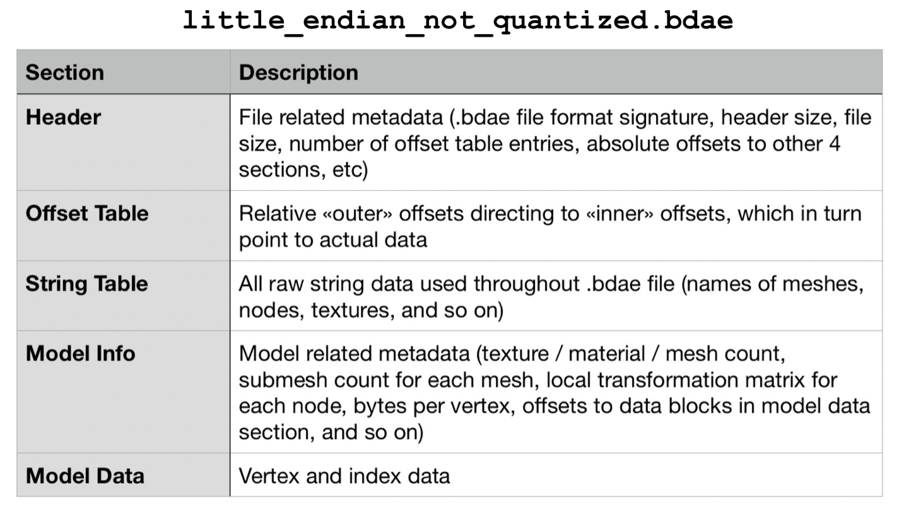

<!-- markdownlint-disable MD001 -->

# .BDAE File Format Parser and Viewer 📄

### Project overview

This project implements a 3D model viewer with 2 modes. First mode allows to view a `.bdae` model (bdae file version 0.0.0.779 used in Gameloft's title Order and Chaos Online), and second mode extends it to render an entire map, which adds up parsing the following Gameloft's file formats: `.trn`, `.itm`, `.phy`, `.nav`, `.msk`, and `.shw` – representing terrain surface, list of .bdae model names and their info, physical surfaces, walkable surfaces, terrain surface textures blending weights, and pre-rendered shadows, respectively. With these game assets integrated and parsed, plus lighting, audio, free-flight camera, and memory optimizations (such as dynamic map loading and asset registration), the project forms a lightweight end-to-end game engine, effectively replacing Gameloft's Glitch Engine (the implementation does not rewrite or imitate it) for rendering tasks in a simplified and understandable way. After compilation, it is a standalone application, written in C++ and using OpenGL 3.3 as its rendering backend, with GLSL for programmable shaders. 

After reading the below documentation, you may clearly understand what is the .bdae file format, which is a result of my combined reverse-engineering and game-engine source code research.

### Main information

All game 3D models are stored in binary files of the .bdae format. They include __data for mesh, material, textures, nodes, bones, SFX, and animations__. BDAE stands for __Binary Digital Access Exchange__ and is a binary version of the DAE format, which itself is written in the XML language common for 3D models. The binary nature of .bdae files makes them superior in terms of size, runtime efficiency, and protection. When developers introduce new game assets, they run a dae2bdae script. __The developer of .bdae is Gameloft — it is used in their games and natively supported by their Glitch Engine__ (which itself is based on the [Irrlicht Engine](https://irrlicht.sourceforge.io/)). .bdae file format is not unified — each game uses a different version of it. Furthermore, each version has 4 subversions. The subversion is likely generated or updated automatically based on the configuration of the Glitch Engine.

Known information about .bdae file format is limited and located across a few forums. This is because __for reading and understanding these files you would have to do reverse-engineering__. For OaC .bdae files, this has been done in [Game Engine Filetypes Reverse Engineering](https://github.com/lOlbas/Game-Engines-Filetypes-Reverse-Engineering). That project provides a file-parsing template to view the structure of a .bdae file in a binary file editor like [010 Editor](https://www.sweetscape.com/010editor/). However, because this is a pure individual-file-based reverse engineering approach without having the game engine's source code as a reference, some 3D model data interpretations remain incomplete or incorrect.

Another problem is that not only can you not easily read and understand .bdae files, but more importantly, there is no convenient software to render the 3D models they contain. Several available tools you might find are based on custom-written plugins that are unstable; they may work on one .bdae version and fail on others. For the OaC .bdae file version, the only reliable option is [Ultimate Unwrap 3D Pro](https://www.unwrap3d.com/u3d/index.aspx), which does support the format, yet can only display a mesh, without any textures applied.

### BDAE file structure

Most likely, the .bdae file structure is based on the [Nintendo BRRES format](http://wiki.tockdom.com/wiki/BRRES_(File_Format)) (perhaps Gameloft got the format specs from Nintendo while developing for one of their platforms and kept it). It consists of 5 sections:

### BDAE model viewer mode

The .bdae viewer consists of:

- `main.cpp` – main file in the project and viewer’s core implementation (explained below).
- `parserBDAE.cpp` – .bdae parsing and rendering logic (explained below).
- `parserBDAE.h` – .bdae compilation flags, header structure, and class definition.
- `shader.h`, `shaders/model.vs`, `shaders/model.fs`, (`shaders/lightcube.vs`, `shaders/lightcube.fs`) – implementation of the graphics pipeline. OpenGL requires GLSL source code for at least one vertex shader and one fragment shader.
- `camera.h` – implementation of the camera system. OpenGL by itself is not familiar with the concept of a camera, so we simulate it using Euler angles.
- `light.h` – light settings for the Phong lighting model and definition of the light source (a light cube is displayed for reference).
- `sound.h` – implementation of the sound playback.
- `libs/miniaudio.h` – single-header library for audio engine.
- `libs/stb_image.h` – single-header library for loading texture images.
- `libs/glad` – library for loading OpenGL functions.
- `libs/glfw` – library for creating windows and handling input.
- `libs/glm` – library for OpenGL style mathematics.
- `libs/imgui` – Dear ImGui library for file browsing and settings UI.
- `libs/oac/io` – input / output library that provides an interface for reading any game resource files from various sources (disk, memory, Gameloft's custom packed resource format, ZIP archives) with efficient memory management and reference counting. It is a part of the Glitch Engine, but has no dependencies on other engine modules.

This mode allows to load and view a .bdae model as textured / wireframe + edges, enable / disable lighting, freely fly around or rotate the model, play sound effects (if the model has them), and change its color appearance (if a model has alternative textures). Furthermore, it supports .bdae 0.0.0.779 subversions from OaC v.1.0.3 and v.4.2.5 (the beta and latest versions of the game, respectively).

__How does the .bdae parser work? $\quad$ (`parserBDAE.cpp`)__

Assume we opened the outer `some_model.bdae` archive file and there is a file `little_endian_not_quantized.bdae` inside it, which is the real file storing the 3D model data (see `main.cpp`), and so we opened this inner file as well. Now, we call the function `Model::init()`, which executes a straightforward __linear parsing__ approach: __1. Reads the .bdae header__ containing offsets to the main file sections. __2. Loads the entire file into memory__ as raw binary data. → __3. Parses the model info section, retrieving texture, material, mesh and node info.__ This section is structured so that general model information (metadata) appears first (e.g. mesh count, mesh info offset), followed by detailed information (e.g. mesh vertex count, mesh vertex data offset, bytes per vertex, offset to submesh info, submesh material name offset, submesh triangle count, submesh index data offset). For example, when retrieving index data, we follow a chain: [model info offset (from file header) → mesh info offset → mesh metadata offset → submesh metadata offset → submesh index data offset → actual data]. The .bdae format looks overly complicated, because it is. The whole thing is just offset madness — offset to offset to offset .. to something. → __4. Parses the model data section, building vertex and index data__ (indices define triangles — they tell which 3 vertices to connect during rendering). In fact, a model can be a combination of multiple meshes, and each of which may be subdivided into several submeshes. A submesh has its own index data, stored consecutively but separately in the .bdae file; this split is defined in the model info section. We therefore iterate over every mesh to extract its vertices and indices: all vertex data goes into a single vector, while index data is stored in separate vectors for each submesh to ensure correct rendering. Then, we return to the function `Model::load()`, which completes the 3D model loading process. It searches for alternative textures and sounds, and uploads the model data to the GPU. The alternative texture search is relatively complex and relies on manually named texture files. It processes the model's file name to generate a name shared by a group of related textures (alternative colors) using "max-match" approach — tests each prefix and selects the one that gives the highest number of matching `.png` texture files found on disk. The sound search is simpler but also depends on manual naming — it looks for `.wav` files on disk containing the model's file name. GPU uploading is done in a standard OpenGL way. We setup 3 buffers: a Vertex Array Object to store vertex attribute configurations, a Vertex Buffer Object to store vertex data, and an Element Buffer Object for each submesh to store index data. In addition, textures are loaded from image files, converted to raw pixel data, and uploaded to the GPU as OpenGL textures. VAO, VBO, EBO(s), and texture(s) reside on the GPU and are referenced via their generated object IDs.

Small reference on __why we need materials and nodes__.

__Without materials, we will not correctly match a submesh to its texture__ — we’d be guessing, likely assigning retrieved textures at random. Materials also store other valuable data, such as references to rendering techniques (shaders), lighting or particle emitter settings, and possibly more.  
These additional material properties aren’t used in this project and therefore haven’t been studied.

__Without nodes, we will not correctly position meshes within the model__. The .bdae format uses a parent-child node hierarchy. A node is a transform entity defining a mesh’s position, rotation, and scale within the model's scene graph. In my implementation, we parse a "base" node list, where each node may or may not have a child. The child node has the same layout, and its local transformation matrix must be multiplied by that of its parent, recursively accumulating the local-to-world transformation.  
This approach is somewhat questionable but it works. Normally, there’s a single root node, and each child applies its local transform relative to its parent. In my code, there’s no root node; instead, we start from the layer of "base" nodes = submeshes, and for each, traverse downward until a child is found. The definition of a "child" in this context is unclear. Another question comes from the fact that the .bdae parser in the Glitch Engine uses a root node.

For both materials and nodes, we use the __string table section as a reference mapping for names__. For instance, to match a submesh with its node, we check whether both point to the same string table entry, which is the material name for this submesh / node.

__How does the .bdae viewer work? $\quad$ (`main.cpp`)__

The viewer is a standard OpenGL application built on fundamental concepts of Computer Graphics. It uses __OpenGL 3.3__ as its rendering backend (core profile, enabling full control over the graphics rendering pipeline), with __GLSL__ for programmable shaders.

Here is a very brief explanation of how any OpenGL app works. An OpenGL program initializes by setting up a window, creating an OpenGL context (the connection between OpenGL and the windowing system), and loading the necessary libraries. → It then compiles shaders to define the graphics pipeline, configures buffers and textures to process and store graphical data on GPU. → During rendering, the program references this data by object ID, executes the shaders, and draws objects on the screen. Once running, the program enters a continuous event loop (also known as the __game / render loop__) where it waits until a new event occurs. The programmer registers callback functions with OpenGL to handle events – such as mouse movement, keyboard input, or window resizes. When an event occurs, the system automatically queues and processes these events, invoking the corresponding callback.

To implement a 3D model viewer, to this basic OpenGL program workflow we need to add the camera system, file‑loading and a settings interfaces (done with the Dear ImGui library), and in the end extra features such as a lighting model, sound playback or display‑mode switching. The .bdae file viewer is complete.

### BDAE terrain viewer mode

The terrain (map) viewer adds:
- `terrain.cpp` –  class for loading and rendering terrain (explained below).
- `terrain.h` – class definition.
- `parserTRN.cpp` – class for loading surface of one terrain tile from a .trn file and storing other tile data.
- `parserTRN.h` – class definition.
- `parserITM.h` – functions for loading game object (.bdae model) names and their world space information of one terrain tile from an .itm file, and for calling .phy + .bdae parsers for each game object.
- `parserPHY.h` – class for loading physics geometry of one game object from a .phy file and storing its mesh data.
- `water.h` – class for loading and rendering water.
- `shaders/terrain.vs`, `shaders/terrain.fs`, `shaders/water.vs`, `shaders/water.fs`, `shaders/skybox.vs`, `shaders/skybox.fs` – shaders for terrain-related entities.
- `libs/oac/base` – utility classes for vector and matrix operations (this dependency should be removed).
- `libs/oac/navmesh` – Detour navigation system library for managing walkable surfaces.

This mode effectively is a game engine and it allows to load and view a terrain with all 3D models, water, and sky, while integrating physical and walkable surfaces. All these terrain entities are loaded from custom Gameloft file formats that had to be analyzed and parsed.

`terrain.cpp` is under 2000 lines of code and can load terrain consisting of 1000 tiles with over 10,000 3D models. A __terrain tile__ is a fixed-size square section (small part) of the terrain, and such partition used primarily for rendering optimization. Instead of rendering the entire map each frame, only a certain number of tiles are drawn, with tiles being activated or deactivated as the camera moves across the map. __The vertex and index data for each tile is precomputed during the initial map loading on CPU, then, in each frame, data buffers on GPU are updated – the engine determines which tiles should be rendered in the current frame based on camera position and orientation (distance-based culling + frustum culling).__ Additional optimizations affect CPU-side map loading — shared pointers for .bdae and .phy models enable a global cache and significantly reduce RAM usage; similar idea is done for terrain surface textures.

$$
1\ \text{tile} = 8 \times 8\ \text{chunks} = 64 \times 64\ \text{world space units}
$$

 These values are not from my imagination – 1 tile = 1 .trn, .itm, .nav, and .msk files, and the layout of binary data stored in them follows the chunk-unit separation structure. Their loading process works as follows: __1. Open one of each .trn / .itm / .msk / .nav / .phy  archive.__ These are ZIP archives with their extensions renamed to match the asset types they contain. Inside each archive, the number of files is less than or equal to the number of terrain tiles — each file represents one tile, and the filename encodes its grid position (for example, `-008_0007.trn` corresponds to (x, z) = (-8, 7) on the terrain grid). Some grid positions may be missing, meaning that either the tile does not exist or specific data for it is unavailable. __2. Iterate over each tile in the terrain (each file in the archive) and call the corresponding parser.__ These parsers store the parsed data in structures or vectors, forming a one-to-one code-level representation of the binary contents of these formats — not yet mesh data. __3. Build meshes (vertex and index data) in world space coordinates.__ Here, the retrieved data and metadata are “unpacked” into a format suitable for OpenGL. For example, vertices are stored in a flat vector where every 3 consecutive vertices form a triangle — the most efficient elementary OpenGL primitive for terrain rendering. __4. Extra – load skybox, set up the camera's starting position, and search for ambient music.__ Skybox is a sphere rather than a cube and it is just a .bdae model. The only difference is that it requires different shaders to create an effect of being "infinitely far away" from the camera.

### Manual

__Pre-compiled builds for Windows / Linux can be downloaded from my [Google Drive](https://drive.google.com/drive/folders/19uDs_jDS1yYuNcj61CEjhljezErinMBC?usp=drive_link)__. They already include the game assets (models and terrain files that can be opened with this viewer) sourced from __OaC v.4.2.5a__. Note that these builds do not support assets from __OaC v1.0.3__ (recompilation is required). Also note that, for performance optimization in terrain viewer mode, I have currently disabled (commented out) the loading and rendering of .phy and .nav files, as these files do not contribute any visual detail.

Compatibility: __.bdae version 0.0.0.779, subversions little-endian 32-bit / 64-bit__   
OS: __Windows / Linux__

__How to compile from source?__
1. Download the game assets archive `assets-oac-v.4.2.5a.zip` from the Google Drive link above, and place the `data` folder in the project's root directory.
2. Download the source code.  
`git clone git@github.com:fata1error404/oac-bdae-viewer.git`
3. Install dependencies.  
For Linux:  
`sudo apt-get install mesa-common-dev`
 –  core OpenGL utilities development headers  
`sudo apt-get install libglfw3-dev libglm-dev` – necessary development libraries (GLFW for handling windowing and input, GLM for OpenGL-style mathematics)  
For Windows:  
[TODO]
4. Compile and launch (same for Windows and Linux).  
`make`  
`./app`

Additionally, you can modify conditional compilation flags defined in `parserBDAE.h`:  
`CONSOLE_DEBUG_LOG` – to show / hide .bdae parser detailed output in the terminal.  
`BETA_GAME_VERSION` – to switch between 32-bit / 64-bit .bdae subversions (from OaC v.1.0.3 and v.4.2.5, respectively).

### Keyboard controls:

__W A S D__ – camera movement  
__Left Mouse Button__ – camera rotation  
__Right Mouse Button__ – model rotation  
__K__ – base / textured mesh display mode  
__L__ – enable / disable lighting  
__F__ – fullscreen mode  
__Escape__ – exit
